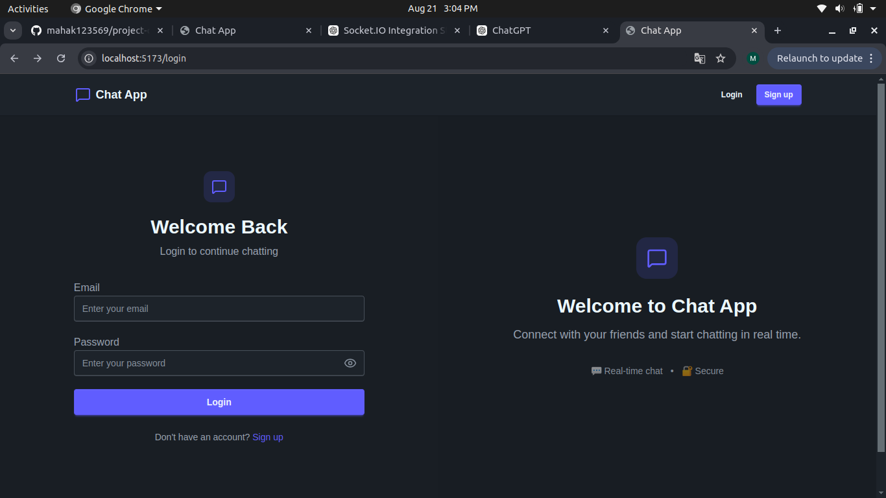
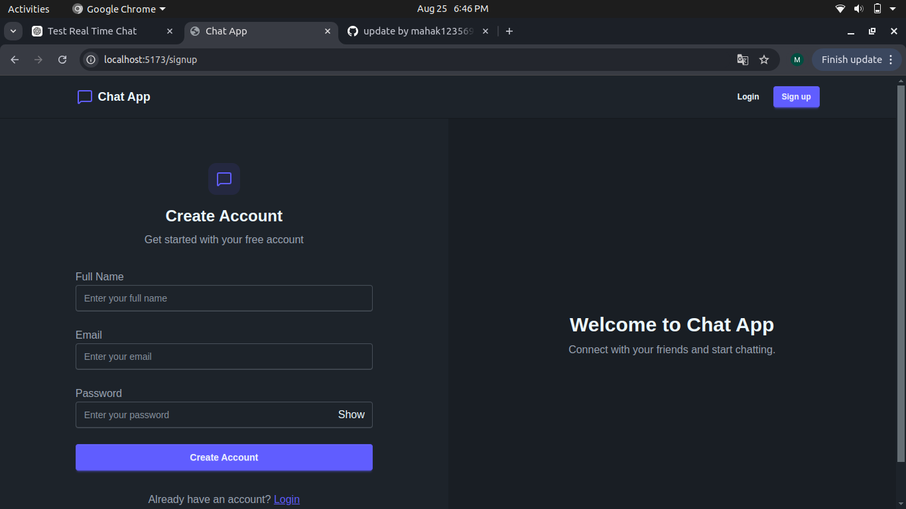
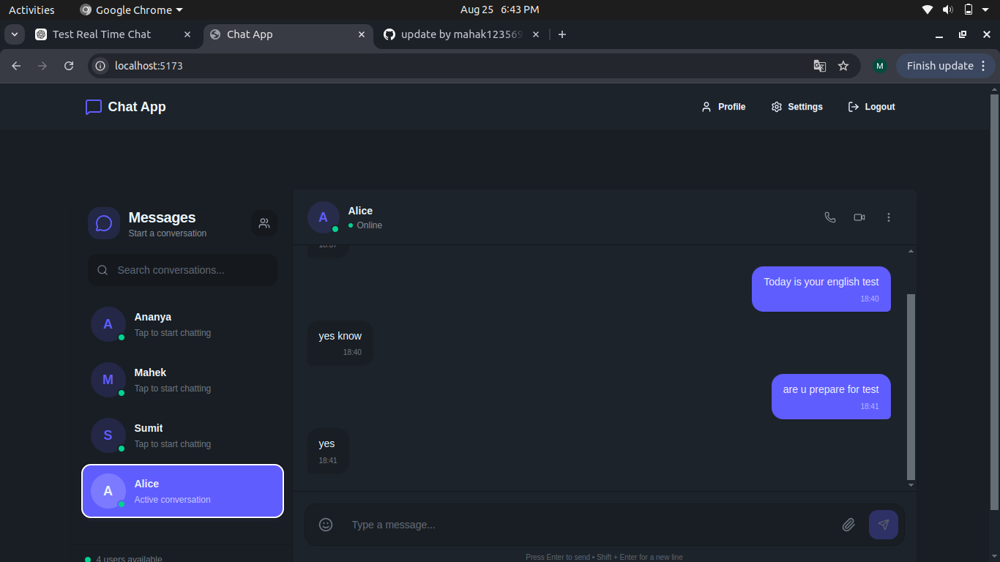
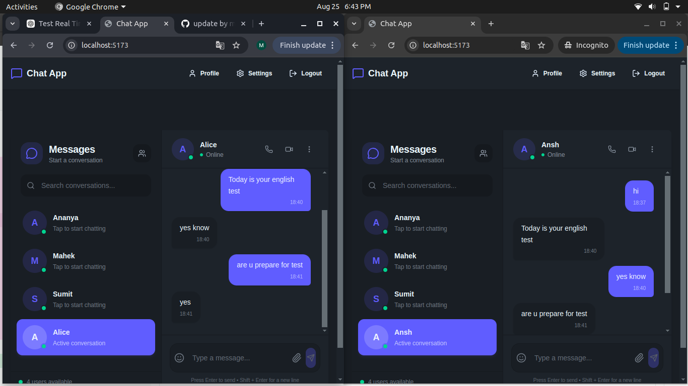
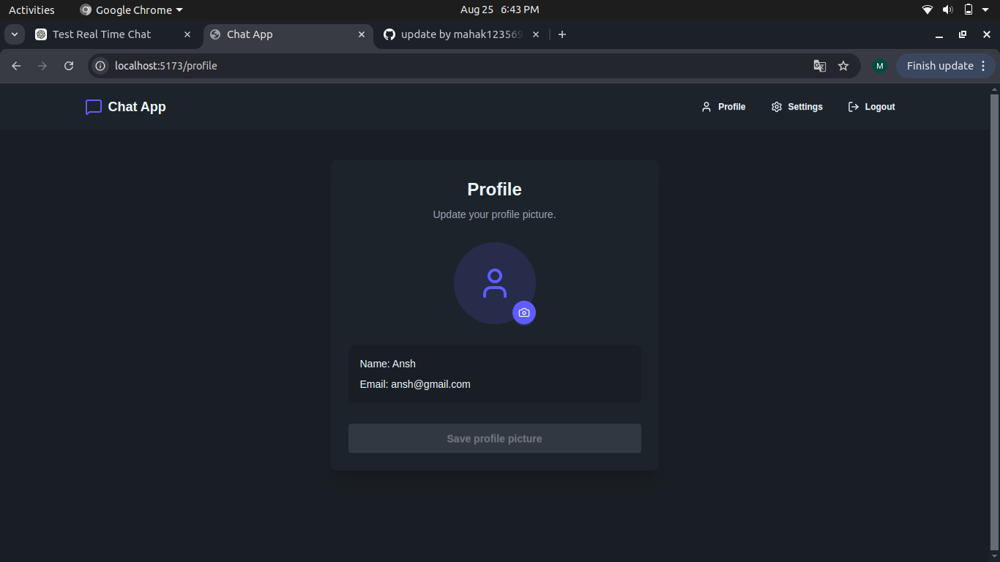

# 💬 Real-Time Chat Application

A full-stack **real-time one-to-one chat application** built with the **MERN Stack** and **Socket.IO**. Users can securely authenticate, send messages in real time, maintain persistent chat history, and share images through Cloudinary.

🔗 **Live Demo:** `ADD_YOUR_DEPLOYED_FRONTEND_URL`
📦 **GitHub:** `https://github.com/mahak123569/project-chatapp`


## ✨ Features

* 🔐 **User Authentication**

  * Signup and login
  * JWT-based authentication
  * Password hashing with bcrypt.js
  * Protected API routes

* 💬 **Real-Time Messaging**

  * One-to-one messaging
  * Instant message delivery using Socket.IO
  * User-specific Socket.IO rooms
  * Messages appear without refreshing the page

* 💾 **Persistent Chat**

  * Messages stored in MongoDB
  * Previous conversations loaded from the database
  * Sender and receiver information stored with each message

* 🖼️ **Image Support**

  * Cloudinary integration
  * Image message support

* 👤 **User Management**

  * User list/sidebar
  * User profile information
  * Profile picture support

* 🎨 **Modern UI**

  * Responsive chat interface
  * Tailwind CSS
  * DaisyUI
  * Modern dark-themed interface
  * Responsive layout for different screen sizes

* ⚡ **State Management**

  * Zustand for frontend application state
  * Axios for API communication


## 📸 Screenshots

### 🔐 Login / Signup

#### Login



#### Signup



---

### 💬 Chat Interface



---

### ⚡ Real-Time Messaging



---

### 👤 Profile


---

## 🛠️ Tech Stack

### Frontend

| Technology       | Purpose                         |
| ---------------- | ------------------------------- |
| React.js         | User interface                  |
| Vite             | Frontend development/build tool |
| Tailwind CSS     | Styling                         |
| DaisyUI          | UI components                   |
| Zustand          | State management                |
| Axios            | HTTP/API requests               |
| Socket.IO Client | Real-time communication         |

### Backend

| Technology | Purpose                 |
| ---------- | ----------------------- |
| Node.js    | Backend runtime         |
| Express.js | REST API framework      |
| Socket.IO  | Real-time communication |
| JWT        | Authentication          |
| bcrypt.js  | Password hashing        |

### Database & Cloud

| Technology | Purpose                 |
| ---------- | ----------------------- |
| MongoDB    | Database                |
| Mongoose   | MongoDB object modeling |
| Cloudinary | Image storage           |

### Development Tools

* Git
* GitHub
* VS Code
* Postman
* npm

---

## 🏗️ Application Architecture

```text
                    ┌─────────────────────┐
                    │      React.js       │
                    │   Tailwind/DaisyUI  │
                    └──────────┬──────────┘
                               │
                     Axios / Socket.IO
                               │
                               ▼
                    ┌─────────────────────┐
                    │   Node.js + Express │
                    │      REST APIs      │
                    └───────┬─────┬───────┘
                            │     │
                 ┌──────────┘     └──────────┐
                 ▼                           ▼
        ┌─────────────────┐        ┌─────────────────┐
        │     MongoDB     │        │    Socket.IO    │
        │ Users/Messages  │        │ Real-time Chat  │
        └─────────────────┘        └────────┬────────┘
                                            │
                                            ▼
                                    ┌─────────────────┐
                                    │ User-specific   │
                                    │     Rooms       │
                                    └─────────────────┘

                         Cloudinary
                             ▲
                             │
                       Image Uploads
```

---

## 📂 Project Structure

```text
project-chatapp/
│
├── frontend/
│   ├── src/
│   │   ├── components/
│   │   ├── Pages/
│   │   ├── store/
│   │   └── ...
│   ├── public/
│   └── package.json
│
├── backend/
│   ├── src/
│   │   ├── controllers/
│   │   ├── models/
│   │   ├── routes/
│   │   ├── middleware/
│   │   ├── lib/
│   │   └── index.js
│   └── package.json
│
└── README.md
```

---

## 🚀 Getting Started

### 1. Clone the repository

```bash
git clone https://github.com/mahak123569/project-chatapp.git
cd project-chatapp
```

### 2. Install backend dependencies

```bash
cd backend
npm install
```

### 3. Install frontend dependencies

```bash
cd ../frontend
npm install
```

---

## 🔑 Environment Variables

Create a `.env` file inside the `backend` directory.

```env
PORT=3002

MONGODB_URL=your_mongodb_connection_string

JWT_SECRET=your_jwt_secret

CLOUDINARY_CLOUD_NAME=your_cloudinary_cloud_name
CLOUDINARY_API_KEY=your_cloudinary_api_key
CLOUDINARY_API_SECRET=your_cloudinary_api_secret
```

> Never commit your `.env` file or expose private API keys in GitHub.

Make sure your environment variable names match the names used in your backend code.

---

## ▶️ Run Locally

### Start Backend

```bash
cd backend
npm run dev
```

Backend will run on:

```text
http://localhost:3002
```

### Start Frontend

Open another terminal:

```bash
cd frontend
npm run dev
```

Frontend will run on:

```text
http://localhost:5173
```

---

## 🌐 Deployment

The application is deployed and available online:

**Live Application**

`ADD_YOUR_DEPLOYED_FRONTEND_URL`

### Production Architecture

```text
User Browser
     │
     ▼
Deployed React Frontend
     │
     ├──── REST API ────► Deployed Express Backend
     │
     └──── Socket.IO ───► Socket.IO Server
                              │
                              ▼
                           MongoDB
                              │
                              ▼
                          Cloudinary
```

### Production Environment Variables

For deployment, configure the required environment variables in your hosting provider instead of committing them to GitHub.

---

## 🔄 Real-Time Messaging Flow

```text
User A
  │
  │ Send Message
  ▼
React Frontend
  │
  │ POST /messages/send/:id
  ▼
Express Backend
  │
  ├── Save message
  │       │
  │       ▼
  │    MongoDB
  │
  └── Socket.IO
          │
          ▼
     Receiver's Room
          │
          ▼
       User B
```

This allows the receiver to see new messages **instantly without refreshing the page**.

---

## 🔐 Authentication Flow

```text
Signup / Login
      │
      ▼
Express Authentication API
      │
      ▼
Password Verification
      │
      ▼
JWT Authentication
      │
      ▼
Protected Routes
      │
      ▼
Authenticated User
```

---

## 🧪 API Testing

The backend REST APIs can be tested using **Postman**.

Main API areas include:

```text
/api/auth
/api/messages
```

Authentication-protected routes require a valid authenticated user.

---

## 📚 What I Learned

Through this project, I gained practical experience with:

* Full-stack MERN application development
* Building REST APIs with Express.js
* JWT authentication and authorization
* Password hashing with bcrypt.js
* MongoDB and Mongoose
* Real-time communication with Socket.IO
* Socket.IO user-specific rooms
* Zustand state management
* Cloudinary integration
* Responsive UI development
* API testing with Postman
* Git and GitHub workflow
* Connecting frontend and backend in a production-style application

---

## 🚀 Future Improvements

Planned improvements include:

* 🟢 Accurate online/offline presence
* ✍️ Typing indicators
* 🔔 Unread message notifications
* 😀 Full emoji picker
* 📎 More file types for sharing
* 📱 Further mobile UI improvements
* 🔍 Improved conversation search
* 🔒 Additional production security improvements

---

## 👩‍💻 Author

### Ananya Kesarwani

**BCA | Full-Stack / MERN Developer**

* GitHub: `https://github.com/mahak123569`
* LinkedIn: `https://www.linkedin.com/in/ananya-kesarwani-2451073b3`

---

## ⭐ If You Like This Project

If you found this project useful or interesting, consider giving the repository a ⭐ on GitHub.

---

## 📄 License

This project is created for learning and portfolio purposes.
